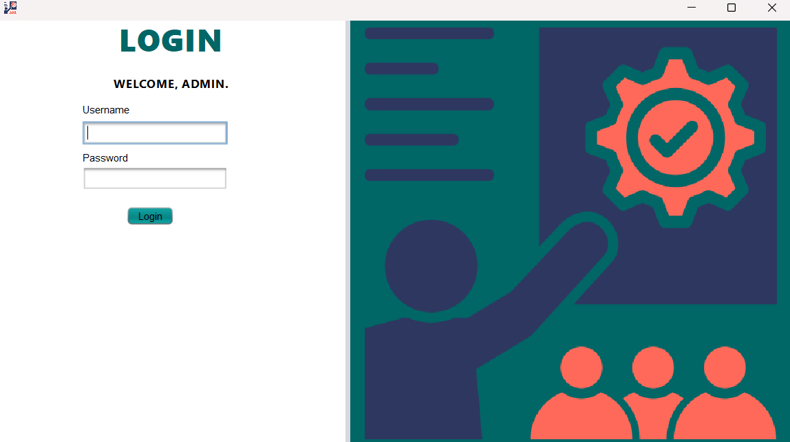
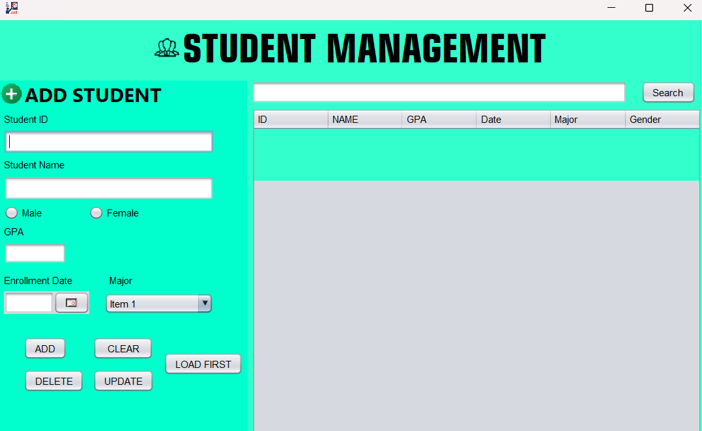
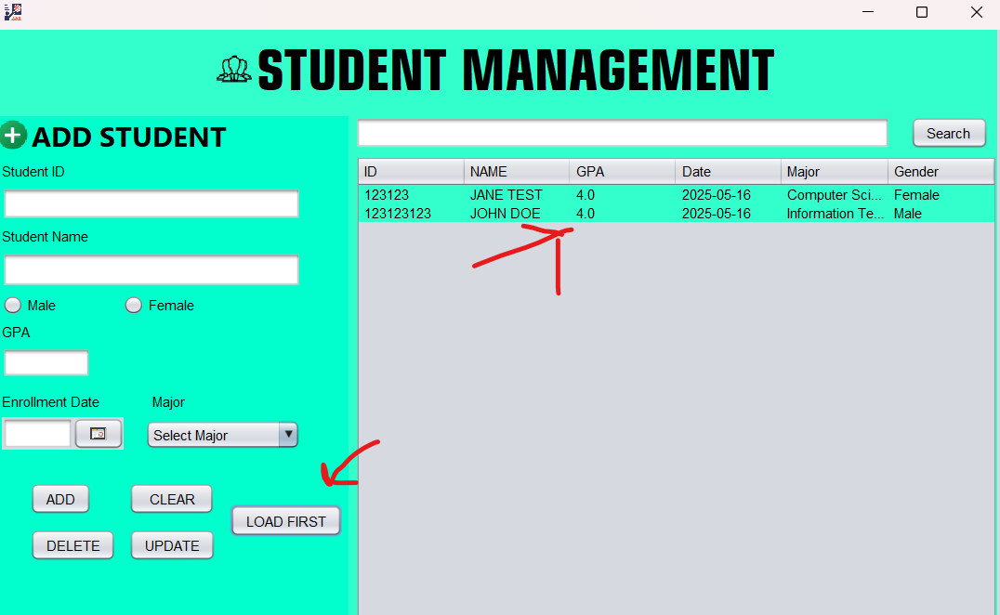
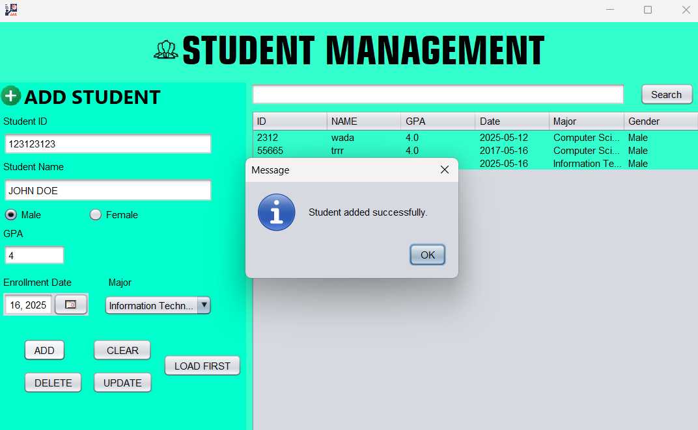
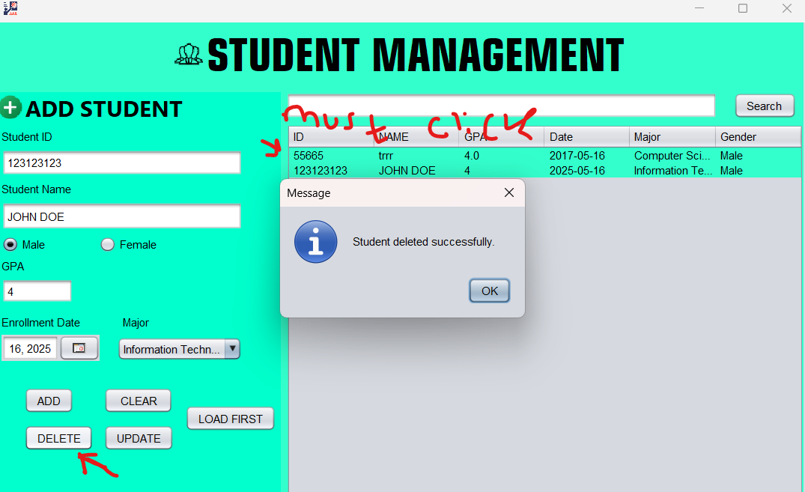
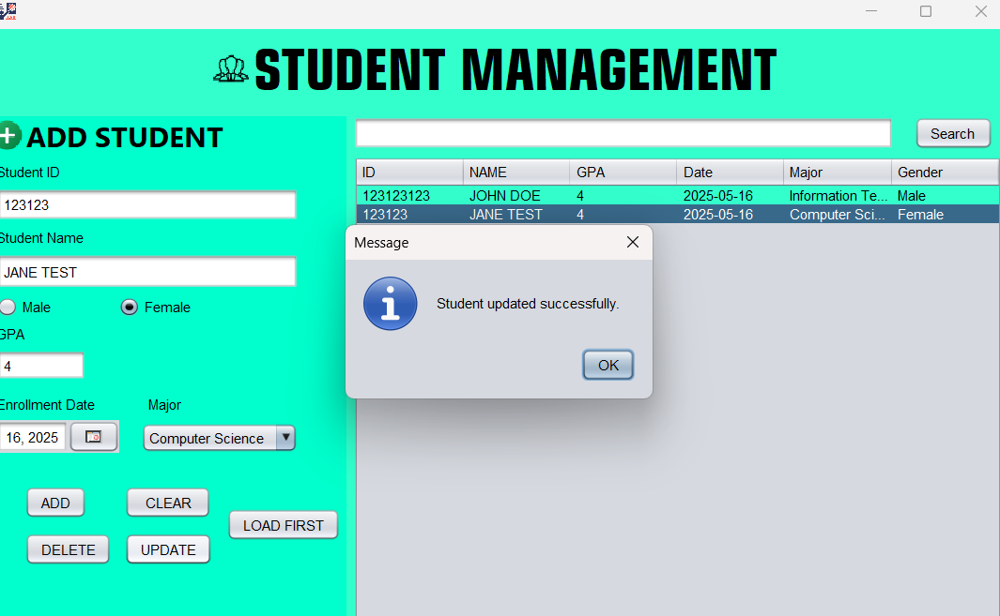

# Student Management System - Java Swing

This repository hosts a comprehensive **Student Management System**, a desktop application developed using **Java Swing** and powered by a **MySQL database**. Designed with a focus on usability and functionality, this application provides administrators with essential tools to manage student records and major information efficiently within an educational or organizational setting. It serves as a practical example of building GUI applications with Java, implementing database interactions, and handling core data operations.

---

## 🌟 Project Overview

The core objective of this project is to create a robust, user-friendly interface for managing student data. It addresses the need for a centralized system where administrators can perform **Create, Read, Update, and Delete (CRUD)** operations on student profiles. The system also includes functionality for managing academic majors and features a search capability to quickly locate specific students.

---

## ✨ Key Features
* **Secure Admin Login**: A dedicated login screen ensures that only authorized personnel can access the management system.
* **Comprehensive Student Dashboard**: The main interface allows for:
    * **Adding New Students**: Input fields for ID, Name, Gender, GPA, Enrollment Date, and Major.
    * **Viewing Existing Students**: A clear, sortable table displays all student records.
    * **Updating Student Information**: Select a student from the table and modify their details in the form.
    * **Deleting Students**: Remove student records from the system.
    * **Loading Data**: Populate the table with the latest data from the database.
    * **Clearing Forms**: Quickly reset input fields.
* **Dynamic Major Management**:
    * Majors are loaded dynamically from the database into a `JComboBox`.
    * (Future enhancement could include a separate interface for managing majors).
* **Database Integration**: Seamlessly connects to a MySQL database using JDBC to store, retrieve, and manipulate data.
* **Efficient Search**: Allows searching for students based on their **Name** or **ID** (current implementation searches by name).
* **User-Friendly Interface**: Built with Java Swing, offering a familiar desktop application experience.
* **Input Validation**: Basic checks to ensure essential fields are filled before adding or updating records.
* **Custom Application Icon**: Enhances the application's visual identity.

---
## Screenshots

### Authentication ###

### Dasboard Management ###

### Load First to get database list ###

### UPDATE, DELETE, ADD BUTTON ###

---

## 🛠️ Technologies & Tools

* **Programming Language**: Java
* **GUI Framework**: Java Swing (javax.swing.*)
* **Database**: MySQL (via phpMyAdmin)
* **Database Connectivity**: JDBC (java.sql.*)
* **Additional Libraries**: JCalendar (com.toedter.calendar.JDateChooser) for easy date selection.
* **IDE**: Apache NetBeans (implied by the code structure)
* **Icons/Images**: Sourced locally (e.g., `/icons/icons8-management-30.png`).

---

## 📊 Database Schema (MySQL)

The system relies on a `student_management` database with the following table structures:

### `admin` Table

Stores credentials for application access.

sql
CREATE TABLE `admin` (
  `admin_id` int NOT NULL AUTO_INCREMENT,
  `username` varchar(50) NOT NULL,
  `password` varchar(255) NOT NULL,
  PRIMARY KEY (`admin_id`)
) ENGINE=InnoDB;

INSERT INTO `admin` (`admin_id`, `username`, `password`) VALUES
(1, 'admin', 'admin123');

students Table
The core table holding all student information.

SQL

CREATE TABLE `students` (
  `id` varchar(10) NOT NULL,
  `name` varchar(100) DEFAULT NULL,
  `major` varchar(100) DEFAULT NULL,
  `gpa` double DEFAULT NULL,
  `enrollment_date` date DEFAULT NULL,
  `gender` varchar(10) DEFAULT NULL,
  PRIMARY KEY (`id`)
) ENGINE=InnoDB;

INSERT INTO `students` (`id`, `name`, `major`, `gpa`, `enrollment_date`, `gender`) VALUES
('2312', 'wada', 'Computer Science', 4, '2025-05-12', 'Male'),
('55665', 'trrr', 'Computer Science', 4, '2017-05-16', 'Male');

majors Table
Stores the list of available academic majors.

SQL

CREATE TABLE `majors` (
  `major_id` int NOT NULL AUTO_INCREMENT,
  `major_name` varchar(255) NOT NULL,
  PRIMARY KEY (`major_id`)
) ENGINE=InnoDB;

INSERT INTO `majors` (`major_id`, `major_name`) VALUES
(1, 'Computer Science'),
(2, 'Information Technology'),
(3, 'Software Engineering'),
(4, 'Electrical Engineering');

Markdown

# Student Management System - Java Swing

This repository hosts a comprehensive **Student Management System**, a desktop application developed using **Java Swing** and powered by a **MySQL database**. Designed with a focus on usability and functionality, this application provides administrators with essential tools to manage student records and major information efficiently within an educational or organizational setting. It serves as a practical example of building GUI applications with Java, implementing database interactions, and handling core data operations.

---

## 🌟 Project Overview

The core objective of this project is to create a robust, user-friendly interface for managing student data. It addresses the need for a centralized system where administrators can perform **Create, Read, Update, and Delete (CRUD)** operations on student profiles. The system also includes functionality for managing academic majors and features a search capability to quickly locate specific students.

---

## ✨ Key Features

* **Secure Admin Login**: (As seen in `image_360a74.png`) - A dedicated login screen ensures that only authorized personnel can access the management system.
* **Comprehensive Student Dashboard**: (As seen in `image_360a2d.png`) - The main interface allows for:
    * **Adding New Students**: Input fields for ID, Name, Gender, GPA, Enrollment Date, and Major.
    * **Viewing Existing Students**: A clear, sortable table displays all student records.
    * **Updating Student Information**: Select a student from the table and modify their details in the form.
    * **Deleting Students**: Remove student records from the system.
    * **Loading Data**: Populate the table with the latest data from the database.
    * **Clearing Forms**: Quickly reset input fields.
* **Dynamic Major Management**:
    * Majors are loaded dynamically from the database into a `JComboBox`.
    * (Future enhancement could include a separate interface for managing majors).
* **Database Integration**: Seamlessly connects to a MySQL database using JDBC to store, retrieve, and manipulate data.
* **Efficient Search**: Allows searching for students based on their **Name** or **ID** (current implementation searches by name).
* **User-Friendly Interface**: Built with Java Swing, offering a familiar desktop application experience.
* **Input Validation**: Basic checks to ensure essential fields are filled before adding or updating records.
* **Custom Application Icon**: Enhances the application's visual identity.

---

## 🛠️ Technologies & Tools

* **Programming Language**: Java
* **GUI Framework**: Java Swing (javax.swing.*)
* **Database**: MySQL (via phpMyAdmin)
* **Database Connectivity**: JDBC (java.sql.*)
* **Additional Libraries**: JCalendar (com.toedter.calendar.JDateChooser) for easy date selection.
* **IDE**: Apache NetBeans (implied by the code structure)
* **Icons/Images**: Sourced locally (e.g., `/icons/icons8-management-30.png`).

---

## 📊 Database Schema (MySQL)

The system relies on a `student_management` database with the following table structures:

### `admin` Table

Stores credentials for application access.

sql
CREATE TABLE `admin` (
  `admin_id` int NOT NULL AUTO_INCREMENT,
  `username` varchar(50) NOT NULL,
  `password` varchar(255) NOT NULL,
  PRIMARY KEY (`admin_id`)
) ENGINE=InnoDB;

INSERT INTO `admin` (`admin_id`, `username`, `password`) VALUES
(1, 'admin', 'admin123');
majors Table
Stores the list of available academic majors.

SQL

CREATE TABLE `majors` (
  `major_id` int NOT NULL AUTO_INCREMENT,
  `major_name` varchar(255) NOT NULL,
  PRIMARY KEY (`major_id`)
) ENGINE=InnoDB;

INSERT INTO `majors` (`major_id`, `major_name`) VALUES
(1, 'Computer Science'),
(2, 'Information Technology'),
(3, 'Software Engineering'),
(4, 'Electrical Engineering');
students Table
The core table holding all student information.

SQL

CREATE TABLE `students` (
  `id` varchar(10) NOT NULL,
  `name` varchar(100) DEFAULT NULL,
  `major` varchar(100) DEFAULT NULL,
  `gpa` double DEFAULT NULL,
  `enrollment_date` date DEFAULT NULL,
  `gender` varchar(10) DEFAULT NULL,
  PRIMARY KEY (`id`)
) ENGINE=InnoDB;

INSERT INTO `students` (`id`, `name`, `major`, `gpa`, `enrollment_date`, `gender`) VALUES
('2312', 'wada', 'Computer Science', 4, '2025-05-12', 'Male'),
('55665', 'trrr', 'Computer Science', 4, '2017-05-16', 'Male');

COLLABORATOR

M. Faza Ar Rantisi |
Resya Aniantri Priatna |
Jagad Alit Kalimosodo

([https://github.com/KanzeroG/StudentManagement])
